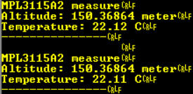
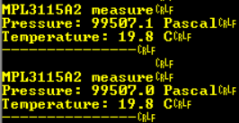

# efr32mg12-mpl3115a2-driver
This is a basic driver for periodic measurements with the MPL3115A2 sensor connected to a Thunderboard Sense 2 (BRD4166A, EFR32MG12) board.

# Development environment
## Software
- IDE: [Simplicity Studio Version: SV4.1.13.7](https://www.silabs.com/products/development-tools/software/simplicity-studio)
- SDK: Gecko SDK Suite: Bluetooth 2.13.4.0, version 2.7.4
- Compiler: GNU ARM v7.2.1
- Serial terminal: [Realterm: Serial Capture Program 2.0.0.70](https://sourceforge.net/projects/realterm/)
## Hardware
- Test hardware: [SLTB004A Thunderboard Sense 2](https://www.silabs.com/development-tools/thunderboard/thunderboard-sense-two-kit)

# Embedded software project
I developed and tested in the Simplicity Studio IDE. I started with the **soc-thunderboard** project, then I removed the unnecessary parts and modified it for the **MPL3115A2** sensor.
## Serial logging
I logged some useful debug information and the measurements to the VCOM:
### Altitude mode
In the Altitude mode I can read the **altitude in meter** and the **temperature in Celsius** degree from the sensor:

### Barometer mode
In the Barometer mode I can read the **pressure in Pascal** and the **temperature in Celsius** degree from the sensor:

# Useful links
- [Xtrinsic MPL3115A2 I2C Precision Altimeter Data Sheet from Freescale Semiconductor](https://cdn-shop.adafruit.com/datasheets/1893_datasheet.pdf)
- [Arduino driver for the MPL3115A2 sensor from Adafruit](https://github.com/adafruit/Adafruit_MPL3115A2_Library/)
- [UG309: Thunderboard Sense 2 User's Guide from Silicon Labs](https://www.silabs.com/documents/public/user-guides/ug309-sltb004a-user-guide.pdf)
